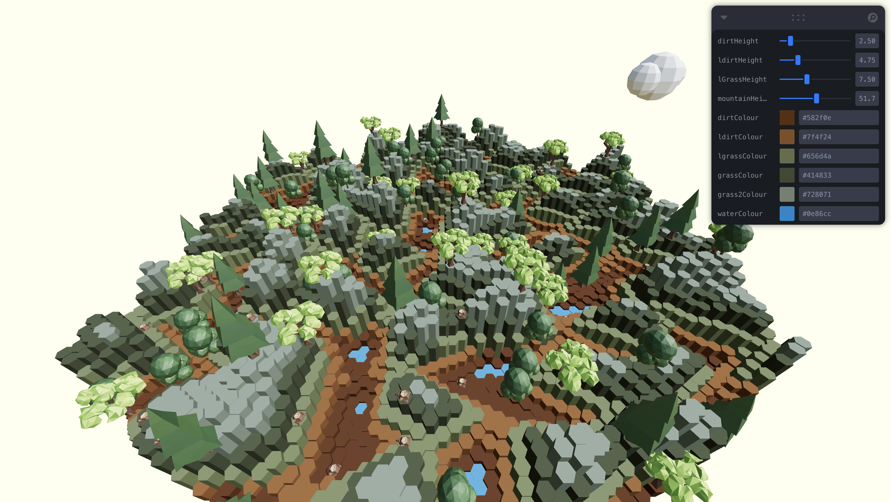
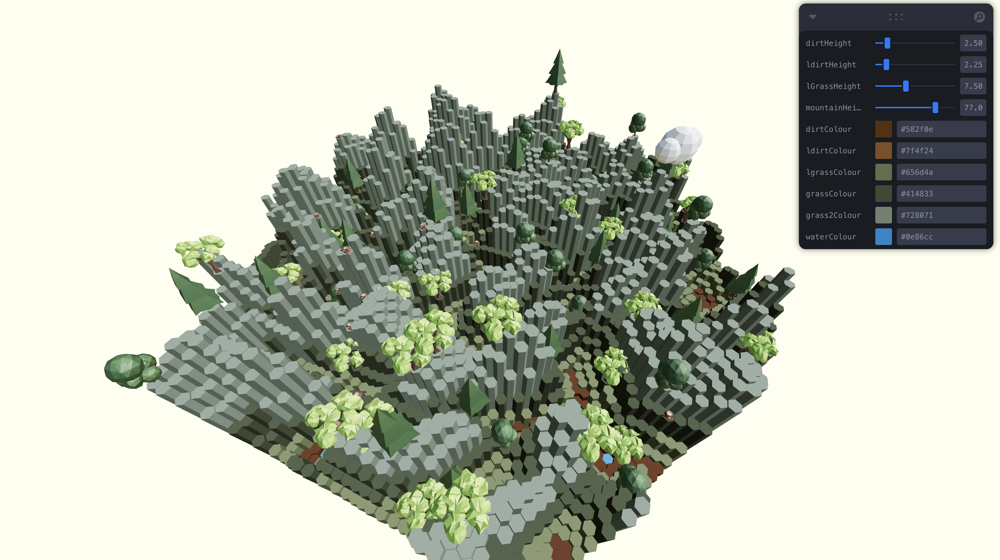

# ＳｕｂＦｏｒｅｓｔ
A web app that uses Perlin Noise procedural generation to visualize any subreddit by creating a forest representing its top posts, statistics, top comments, etc. in the form of trees, clouds, etc.

Utilizes React-Three-Fiber (React/Three.js) on the front-end and Flask on the back-end, with the back-end acting as a REST API to communicate with the front-end. 

**Current Progress screenshots as of Feb 28, 2025**

*P.S*: This is literally the best guide on the planet to Hexagonal grids (I LOVE YOU RED BLOB GAMES):
- https://www.redblobgames.com/grids/hexagons-v1/#basics
